# Tourating

Using Google maps to rating and reviewing your touring experience in different places by dropping
their location (Latitude, Longitude).

**Using**

- Constraint Layout
- Jetpack
    - Compose
    - Navigation
    - Room
- Google maps
- MVVM
- Location permission

## Screenshots

### Portrait

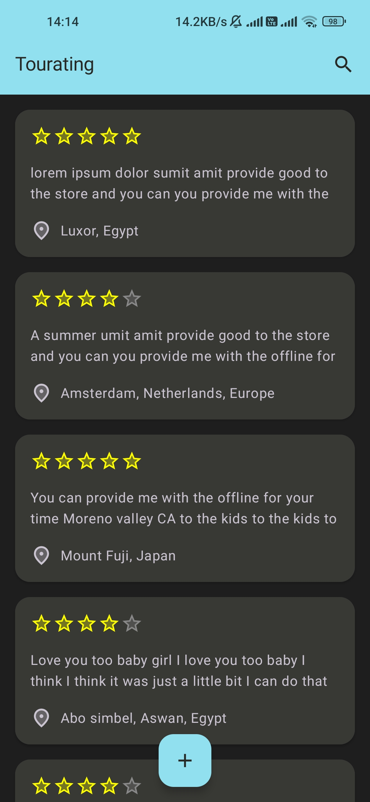 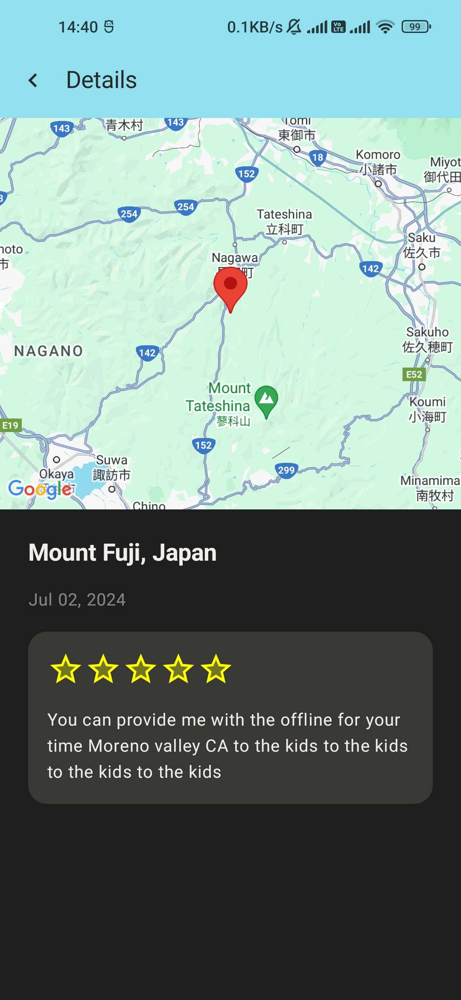
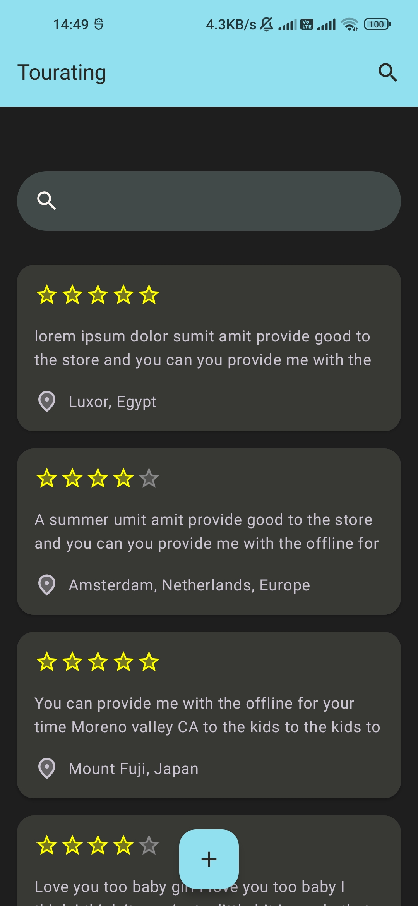
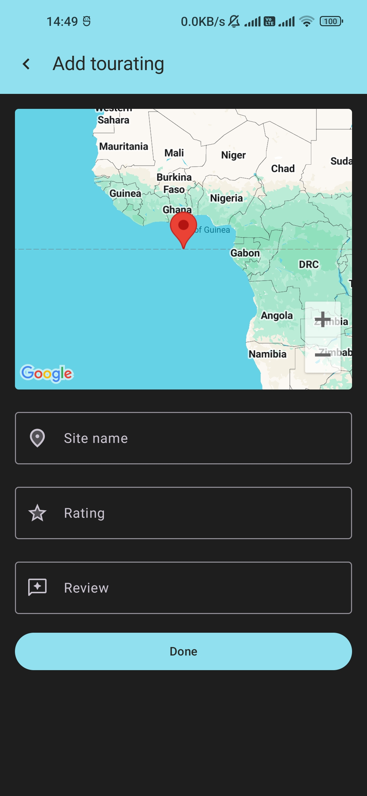
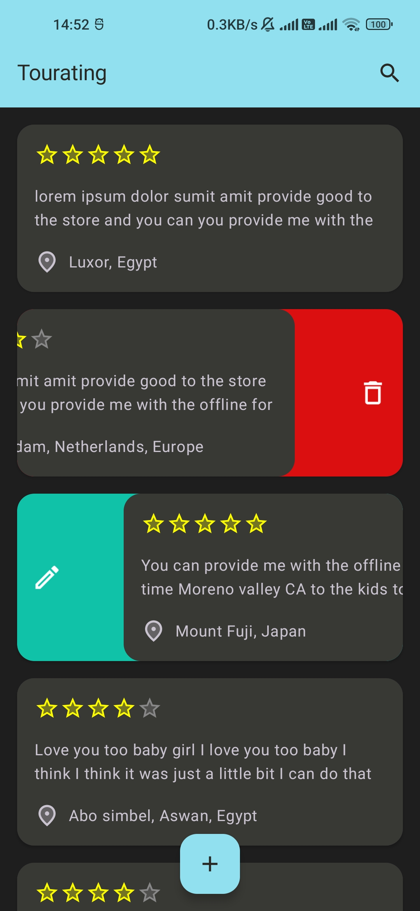
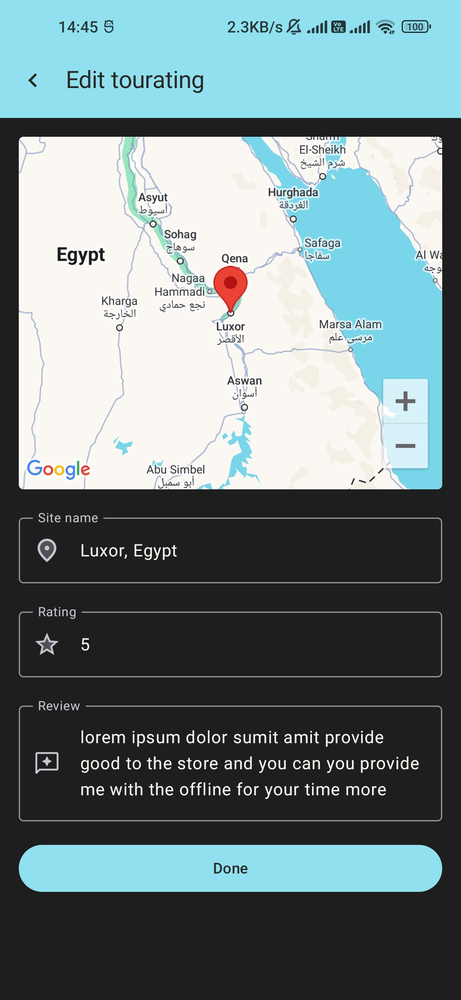
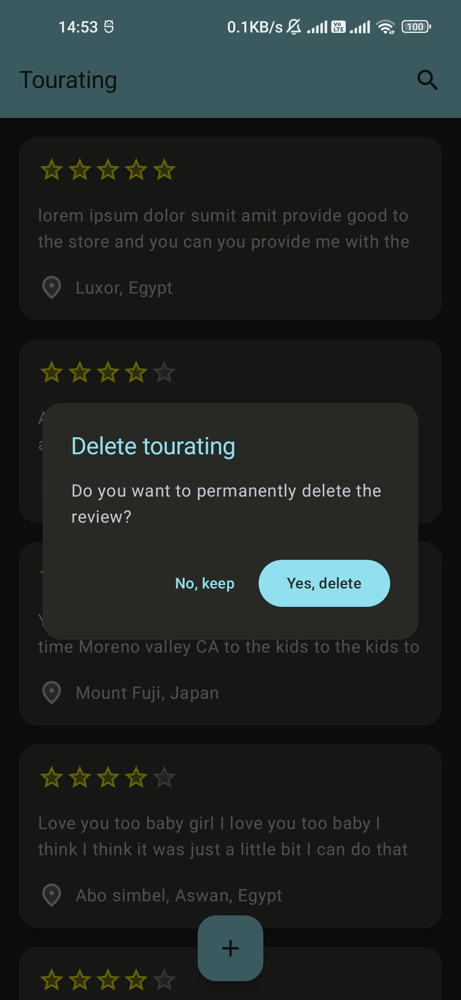

### Landscape

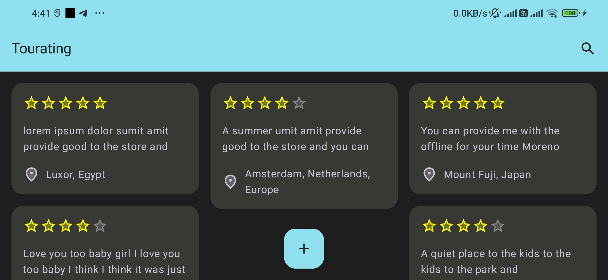
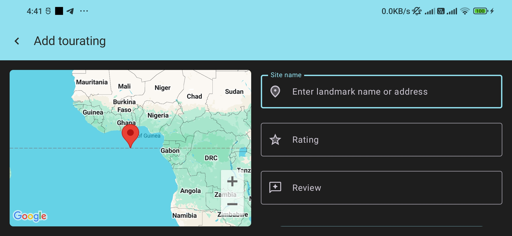
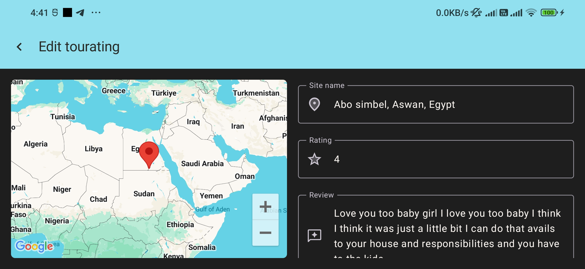
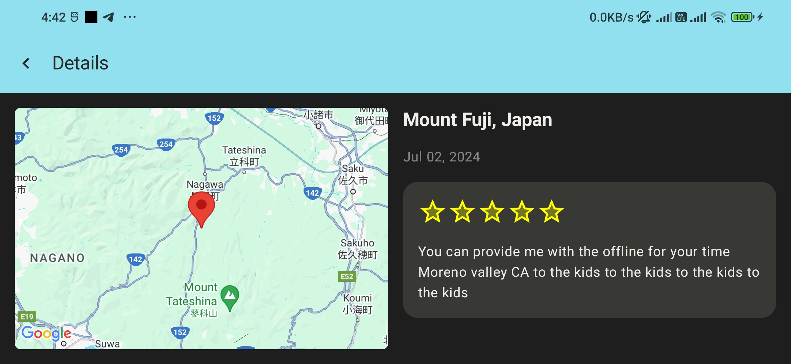